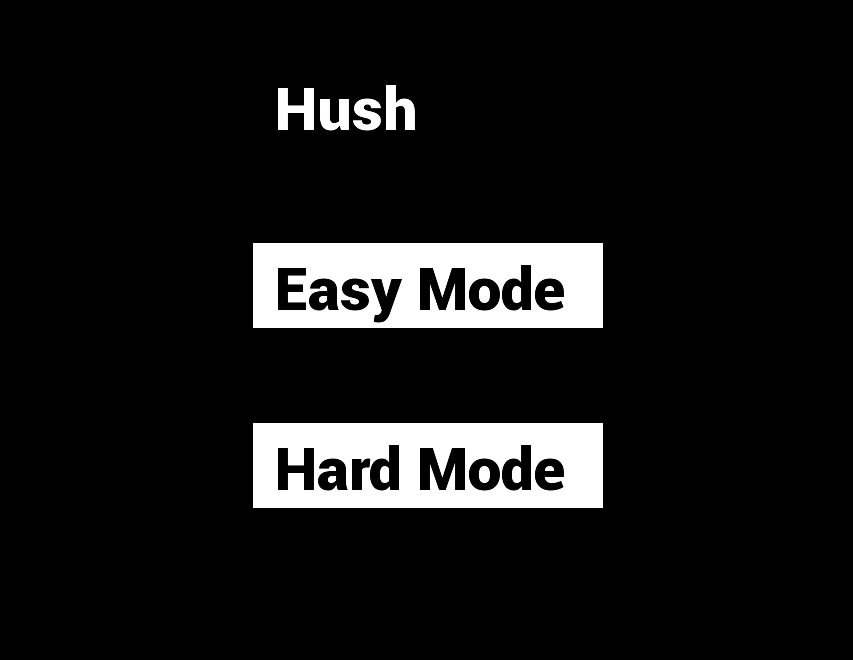
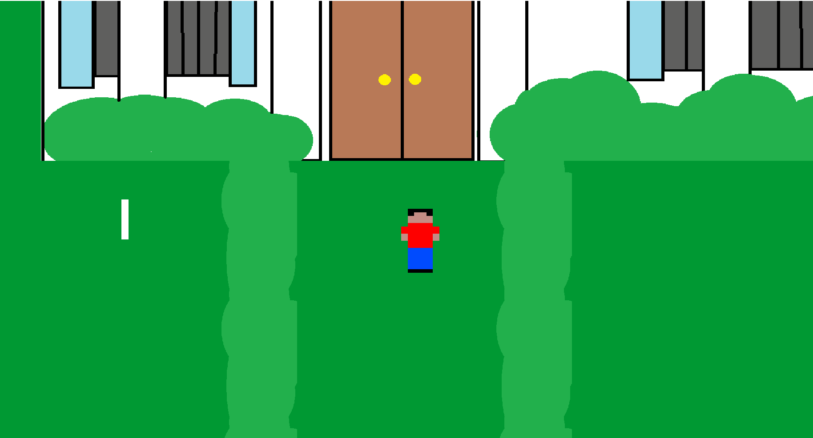

# Java-libgdx-Dev-Projects
Older game dev projects I have worked on. Most are small proof of concepts of mechanics. Each has a small description and preview of what I worked on.

## Hush

Hush was collaboration with my Pathways to Tech students during the Fall 2020 semester. Students in class came up with the idea of a game where you sneak around a house with the main mechanic revolving around stealth and sound. Students designed mechanics that would immersive the player with having to use sound to navigate the house. The game was developed in Java using the LibGDX framework.

Mechanics:
* Player can move around using WASD
* Player can interact with objects using the mouse including doors
* Player running is animated
* Rain outside is animated

Notes:

The game is not complete and is missing a lot of features as we got interrupted by Covid-19. 

## 2D Platformer

This is a small proof of concept with several mechanics for a small 2D platformer. The game was developed in Java using the LibGDX framework.

Mechanics:
* Collision
* Gravity
* Jumping/Movement

## MU Puzzle Game

## The Hound

## The Hound 2

## NonGuiTheHound