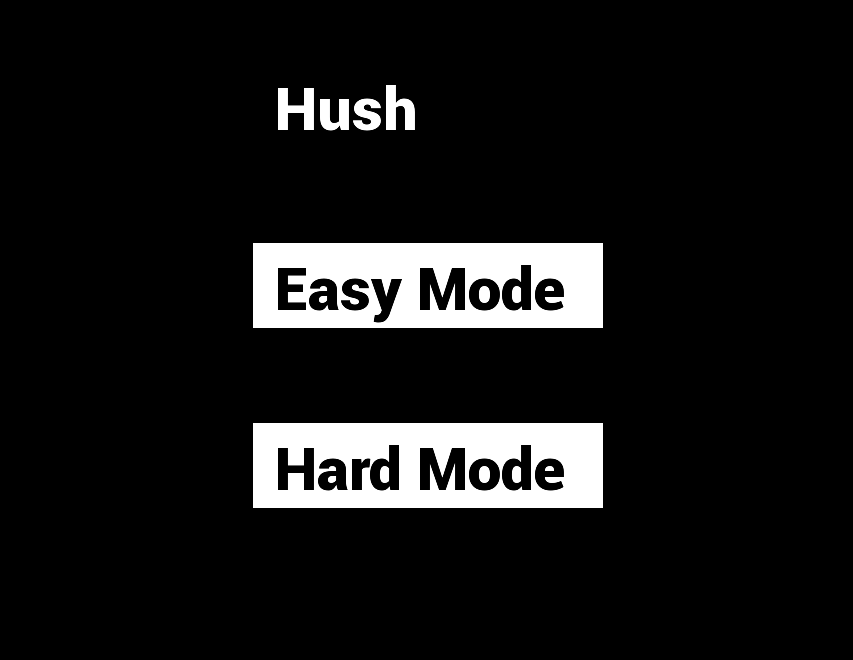
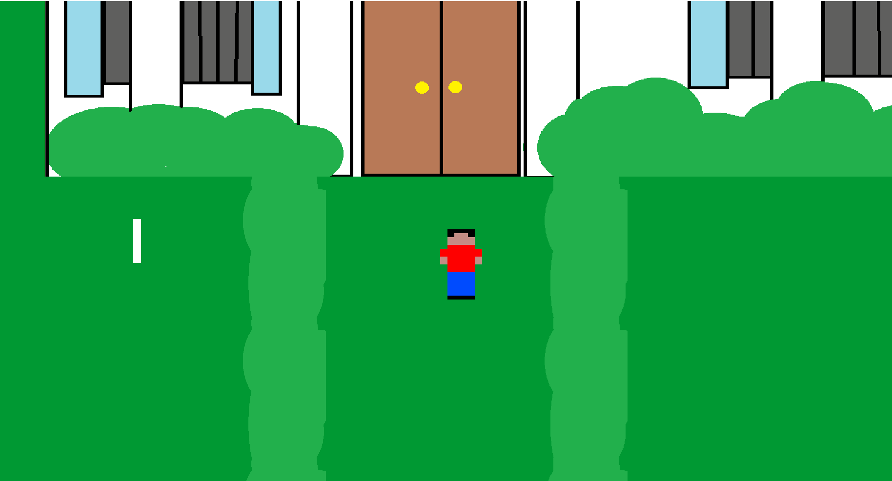

# Java libGDX Game Development Projects — Historical Archive Museum

> **Status:** `[ARCHIVED]` — Consolidated Historical libGDX Snapshot Museum (December 2023)  
> **Repository Context:** Retrospective collection consolidating 8 older Java/libGDX game prototypes and mechanics experiments whose original Git histories were merged or lost.  
> **Original Active Development:** ~2019 – 2021 (Consolidated December 10, 2023)  
> **Stack:** Java, libGDX, Gradle, Tiled TMX Maps, A* Pathfinding, Custom 2D Physics

This repository preserves an immutable snapshot museum of eight standalone Java game development prototypes and systems experiments created with the **libGDX** framework.

---

## 1. Catalog of Contained Projects

### 1. `Hush` (Fall 2020 — Student Collaboration)
- **Pedagogical Context:** Developed in collaboration with Pathways to Technology high-school students during the Fall 2020 semester. Students conceived a stealth/horror game centered on navigating a dark house using acoustic cues and sound mechanics.
- **Implemented Mechanics:**
  - 8-directional WASD movement with velocity/acceleration and wall collisions.
  - Interactive mouse object detection (opening doors, room transitions).
  - Directional character sprite running animations.
  - Atmospheric environmental effects (animated screen-space rain).
- **Archival Notes:** The acoustic/sound-navigation subsystem was not yet implemented before development was interrupted by COVID-19 remote learning shifts.

---

### 2. `Colony` (Early Colony Simulation Prototype)
- **Domain & Inspiration:** Early RimWorld-style autonomous colony simulation.
- **Implemented Architecture:**
  - Selectable worker entities with A* pathfinding and target destinations.
  - Centralized `ActionManager` tracking global work queues (e.g., trees designated for harvesting).
  - Autonomous task assignment: Idle entities query the global work queue and autonomously pathfind to designated tasks.
  - **Foundational Architectural Note:** Embedded comment: *"Will eventually need an engine that picks what the pawns will be doing based on thier perfrence"*, marking the early pre-AI impulse toward autonomous agent decision-making.

---

### 3. `MUPuzzle` (Formal Systems Puzzle)
- **Domain:** Interactive computational formal system based on Douglas Hofstadter's *Gödel, Escher, Bach* MI $\to$ MU string-rewriting challenge.
- **Implemented Features:** Swing/libGDX UI displaying the formal transformation rules. Serves as a prototype shell for formal logic puzzles.

---

### 4. `Platformer` ("Mistborn Game" — 2D Platformer Mechanics Spike)
- **Domain:** 2D platforming physics engine.
- **Implemented Mechanics:**
  - Tile-based environmental collisions.
  - Jump arcs, gravity simulation, and variable horizontal velocity.

---

### 5. `RPG` (Tiled/TMX Map & Dialogue Prototype)
- **Domain:** Top-down 2D RPG environment.
- **Implemented Features:**
  - Tiled (.tmx) map integration with multi-layer parsing (background, collision, object layers).
  - Player spawn point extraction and interactive object click detection.
  - Dialogue GUI window scaffolding.

---

### 6. `TheHound`, `TheHound2`, & `NonGuiTheHound` (The Hound Experiment Family)
- **Domain:** Systems-driven RPG exploring the tension between authored player experience (Animal Crossing) and autonomous world simulation (RimWorld).
- **Note:** Also preserved with detailed comparative analysis in [`TheHoundProofOfConcept`](https://github.com/admiralorbiter/TheHoundProofOfConcept).

---

## 2. Intellectual Lineage: The Pre-AI Autonomous Agent Thread

`Colony` and `NonGuiTheHound` represent a foundational stepping stone in your cognitive architecture:
- Moving from **direct player control** (WASD pushing pixels) to **designing autonomous agent ecologies** (pawns with preferences selecting tasks from a shared world blackboard).
- This core architectural model directly foreshadows **Terrarium** (stigmergic artificial life simulations) and **Mother Base** (autonomous worker coordination).

---

## 3. Archival Notice

Preserved as an immutable historical museum snapshot. The underlying prototypes are complete for their research goals and are no longer actively maintained.
